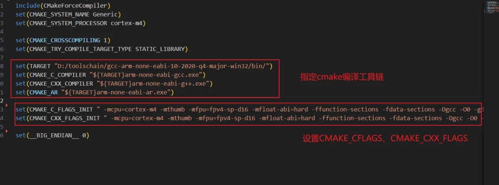

# 快速上手micro ros && RT-Thread（serial和udp方式）

## 1.背景介绍

Micro-ROS（Micro Robot Operating System）是ROS 2（Robot Operating System 2）的嵌入式版本，专门设计用于在嵌入式系统中运行，以支持机器人和嵌入式设备的实时控制和通信。Micro-ROS的目标是将ROS 2的强大功能扩展到资源受限的嵌入式平台，例如微控制器和嵌入式系统。

Micro-ROS的出现使得嵌入式系统和机器人应用能够更紧密地与ROS 2生态系统集成，从而实现更高级别的机器人自动化和控制。它为开发人员提供了一种在嵌入式环境中构建复杂机器人系统的方法，无论是在无人机、自动导航车辆还是其他嵌入式控制应用方面。

*   micro ros分层模块架构


以下是Micro-ROS的一些关键特点和概念：

1. **嵌入式系统支持：** Micro-ROS旨在在嵌入式系统上运行，包括微控制器和其他资源受限的硬件。它提供了一个轻量级的ROS 2堆栈，以便将ROS 2功能集成到这些系统中。

2. **实时性和硬件抽象：** Micro-ROS支持实时性需求，使其适用于对实时性要求较高的应用程序。此外，它提供了硬件抽象层（HAL），允许在不同嵌入式平台上使用相同的ROS 2代码。

3. **通信和中间件：** Micro-ROS使用ROS 2通信机制，因此可以无缝地与其他ROS 2系统通信。它支持多种通信方式，包括串口、UDP、以太网等。

4. **适用于机器人和自动化：** Micro-ROS的主要应用领域包括机器人和自动化系统。通过将ROS 2的能力引入嵌入式系统，开发人员可以更轻松地构建具有传感器、执行器和通信需求的机器人应用。

5. **可扩展性：** Micro-ROS可以根据应用程序的需求进行扩展和定制。开发人员可以选择要包括的ROS 2功能和模块，以适应其特定应用场景。

6. **开源：** Micro-ROS是开源项目，遵循ROS 2的开源精神。这意味着开发人员可以自由地访问、使用和贡献到该项目。

本文将教你如何快速上手使用如何在 RT-Thread上运行 micro-ros，使用包括串口（serial）和UDP两种通信方式与主机 ROS 通信。

## 2.工程准备工作

### 2.1 克隆 RT-Thread主仓

```bash
$ git clone https://github.com/RT-Thread/rt-thread.git
```

### 2.2 克隆 env-windows

```bash
$ git clone --recursive --depth 1 https://github.com/RT-Thread/env-windows.git
```

克隆下来的 env-windows 可以放在D盘，同时双击打开 `env.exe`，待启动`ConEmu`终端后将其注册到鼠标右键快捷方式


## 3.编译准备工作

### 3.1 python & cmake安装

首先去官网安装如下工具：

*   python（大于python36）：https://www.python.org/downloads/windows/
*   cmake（大于v3.22）:https://cmake.org/files/

### 3.2 scons工具安装

打开 windows powershell ，使用  python 安装 scons

```bash
$ pip3 install scons
```

### 3.3 GNU make安装

GNU make 的安装可以参考该 issue 的三种方式

*   https://github.com/kurisaW/micro_ros_rtthread_component/issues/5

这里我选择的是使用choco安装make，打开windows powershell（管理员）：

```bash
$ Set-ExecutionPolicy Bypass -Scope Process -Force; iex ((New-Object System.Net.WebClient).DownloadString('https://chocolatey.org/install.ps1'))
$ choco install make
```

### 3.4 Fastgithub安装

为了防止在后续下载 micro ros 过程中 GitHub 仓库拉取失败，可以下一个 Fastgithub 来加速 GitHub

*   https://github.com/dotnetcore/FastGithub/releases/download/2.1.4/fastgithub_win-x64.zip

## 4.工程配置

选择一份 bsp 进行 micro_ros 的开发，这里我使用的是 RTT 最近出的星火Spark

```bash
$ cd .\rt-thread\bsp\stm32\stm32f407-rt-spark
```

### 4.1 指定工具链

去官网下载 `gcc-arm-none-eabi-10-2020-q4-major-win32`工具链，注意不用配置到环境变量中，以免发生冲突

*   [gcc-arm-none-eabi-10-2020-q4-major-win32.exe](https://developer.arm.com/-/media/Files/downloads/gnu-rm/10-2020q4/gcc-arm-none-eabi-10-2020-q4-major-win32.exe?revision=9a4bce5a-7577-4b4f-910d-4585f55d35e8&rev=9a4bce5a75774b4f910d4585f55d35e8&hash=9770A44FEA9E9CDAC0DD9A009190CC8B)

修改 bsp 工程下的 rtconfig.py 文件，指定 gcc 工具链


### 4.2 micro_ros 软件包配置

回到`.\rt-thread\bsp\stm32\stm32f407-rt-spark`目录下，打开 ConEmu 执行如下命令生成 packages 目录

```bash
$ pkgs --update
$ cd packages
```

克隆 micro_ros 配置仓库

```bash
$ git clone -b win_arm-gcc https://github.com/kurisaW/micro_ros_rtthread_component.git
```

我们来看下目录层次：

```bash
├─micro_ros_rtthread_component
│  ├─.images
│  ├─builder
│  │  ├─extra_packages
│  │  ├─metas
│  │  ├─microros_utils
│  │  └─patchs
│  │      ├─foxy
│  │      └─humble
│  ├─docs
│  ├─examples
│  ├─include
│  ├─package
│  │  └─micro_ros_rtthread_package
│  └─src
```

这里我们需要将`micro_ros_rtthread_package`目录复制一份到`..\env-windows\packages`目录下，同时修改`..\env-windows\packages\Kconfig`内容如下：

```Kconfig
source "$PKGS_DIR/packages/Kconfig"
source "$PKGS_DIR/micro_ros_rtthread_package/Kconfig"
```

### 4.3 指定Cmake编译工具链

想要在 RT-Thread 中使用 micro_ros ，需要先通过 Cmake 编译得到一份 `libmicroros.a`静态链接库文件，下面是 micro_ros Cmake 的相关配置：

回到目录：`..\rt-thread\bsp\stm32\stm32f407-rt-spark`

使用 ENV 生成 CMakeLists.txt 文件，里面包含了工程的配置编译选项：

```bash
$ scons --target=cmake
```

此时我们在当前目录下就可以看见一个 `CMakeLists.txt`文件了，同时我们进入目录`.\rt-thread\bsp\stm32\stm32f407-rt-spark\packages\micro_ros_rtthread_component\builder`，找到`toolchain.cmake`文件，参考前面生成的`CMakeLists.txt`文件修改`toolchain.cmake`



### 4.4 micro ros 在 ENV 中的配置

再次回到`..\rt-thread\bsp\stm32\stm32f407-rt-spark`目录下，打开 ENV 勾选配置：

```bash
[*] micro-ROS package for RTThread                                    
                [*]   Include examples                                                       
                      Distribution (Foxy)  --->                                                   
                      Memory configuration  --->                                                     
                      ROS node communication mode (serial)  --->
```

其中在`Memory configuration`中的`Publishers`和`Subscribers`这两个参数值要求大于2，因为在 micro_ros 的示例工程：micro_ros_ping_pong要求至少两个发布者和两个订阅者，同时我们选择通信模式为 `serial`

此外，我们需要一个串口进行通信，根据板载情况勾选一个串口设备，并确保该串口成功创建！！

同时我们使用 vscode 打开文件`packages\micro_ros_rtthread_component\src\rtt_serial_transport.c`，搜索宏`MICRO_ROS_SERIAL_NAME`并修改为你新创建的串口设备名。

## 5.开始编译

回到`.\rt-thread\bsp\stm32\stm32f407-rt-spark`目录下，鼠标右键打开 windows powershell ，输入如下命令：

```bash
scons --build_microros
```

此时我们就可以看到 python 会自动安装依赖包并且开始下载 microros所需的依赖库，并且该依赖库的安装位置位于 `C:\Users\$user\AppData\Local\Temp\micro`下

这里的配置项主要位于`packages\micro_ros_rtthread_component\builder\SConscript`文件中，由于不同的工具链和平台所使用的一些标准C库函数有些不同差异，所以目前是基于 cortex-M4 适配了 micro_ros 库，在`packages\micro_ros_rtthread_component\builder\microros_utils\repositories.py`文件中更改了一些仓库分支为我修改的仓库分支，后续会以补丁文件的形式发布


编译完成后会使用 ar 将所有依赖的 micro_ros 库文件动态链接成 `packages\micro_ros_rtthread_component\builder\libmicroros\libmicroros.a`文件，同时将`C:\Users\20537\AppData\Local\Temp\micro\mcu\install\include`目录复制到`packages\micro_ros_rtthread_component\builder\libmicroros\include`目录下

编译完成后我们就得到了 rt-thread.elf 文件，可以使用 STM32CubeProgrammer 工具进行烧录到星火Spark上

附：这里说下 GCC-AR 是什么：GCC-AR 是 **gcc配套的库管理工具**，它可以创建，修改和提取静态库（.a文件）。 通过使用 GCC-AR，可以将多个相关的对象文件（.o文件）打包成一个静态库，以方便在后续的编译过程中重复使用这些对象文件。


## 6.WSL安装及 usbipd 支持

*   WSL安装：WSL的安装具体可以看网上怎么操作的，此处不再赘述

*   Docker安装：打开 wsl 终端，使用官网脚本一键安装即可

```bash
$ curl -fsSL https://test.docker.com -o test-docker.sh
$ sudo sh test-docker.sh
```

*   usbipd支持

请参考这篇文章完成 usbipd 的支持：https://club.rt-thread.org/ask/article/8671e03210f950a7.html

## 7.serial测试

此处仅给出相关命令，具体流程请参考演示视频：

```bash
# windows powershell端
$ usbipd wsl list	// 查看系统USB设备列表
$ usbipd wsl attach --hardware-id "usb-id"		// 连接usb至wsl

# wsl ubuntu20.04（注意：目前支持的microros版本：foxy支持的ubuntu版本为ubuntu20.04）
$ sudo docker run -it -v /dev:/dev --privileged microros/micro-ros-agent:foxy serial --dev /dev/ttyACM0		// 运行docker microros：foxy代理
$ ros2 topic list	// 查看ros topic列表
$ ros2 topic echo /micro_ros_rtt_subscriber		// 打印话题详情
$ ros2 topic pub /micro_ros_rtt_subscriber std_msgs/msg/Int32  data:\ 10	// 发布topic data值为10
```

**演示视频：[[点击此处精准空降: microros_rtt_serial]](https://www.bilibili.com/video/BV1se41197Ea?t=3.8)**

## 8.udp4测试

### 8.1 准备工作

首先需要在linux本地 搭建好 ROS 环境，micro-ros环境的安装参考**[[鱼香大佬的网站]](https://fishros.com/d2lros2foxy/#/chapt2/2.3ROS2%E7%9A%84%E5%AE%89%E8%A3%85)**

**注意：我们安装的ros版本为 `ros:foxy`**

继续搭建 micro-ros 构建环境，打开linux终端，按照如下步骤一步步走：

```bash
# 激活ros:foxy环境
$ source /opt/ros/foxy/setup.bash

# 创建工作区并拉取micro_ros_setup仓库
$ mkdir /home/$user/microros_ws && cd /home/$user/microros_ws
$ git clone -b foxy https://github.com/micro-ROS/micro_ros_setup.git src/micro_ros_setup

# 更新rosdep
$ sudo apt update
$ export ROSDISTRO_INDEX_URL=https://mirrors.tuna.tsinghua.edu.cn/rosdistro/index-v4.yaml
$ rosdep update --include-eol-distros
$ rosdep install --from-paths src --ignore-src -y

$ sudo apt-get install python3-pip

# colcon编译
$ colcon build
$ source install/local_setup.bash

# 创建一份固件工作区
$ ros2 run micro_ros_setup create_firmware_ws.sh host

# 构建固件
$ ros2 run micro_ros_setup build_firmware.sh
$ source install/local_setup.bash

# 创建microros代理
$ ros2 run micro_ros_setup create_agent_ws.sh

# 构建代理
$ ros2 run micro_ros_setup build_agent.sh
$ source install/local_setup.bash
```

完成上述工作后我们micro ros的代理环境就准备就绪了

### 8.2 以 UDP 方式开启micro_ros 代理

```bash
$ ros2 run micro_ros_agent micro_ros_agent udp4 --port 9999
```

### 8.3 udp测试流程

这里就不讲详细的配置了，具体过程请看下方链接：

**演示视频：[[点击此处精准空降: microros_rtt_serial]](https://www.bilibili.com/video/BV1h84y1R7P6?t=2.6)**

## 9.几点说明

*   为什么编译不使用 ConEmu ：因为 ConEmu 内部集成的是 python27 ，而 micro_ros 编译所需的 python 版本最低为 python36，建议使用 python38 及以上版本

*   如果是使用的串口方式通信，不推荐在虚拟机上运行docker microros 代理，虚拟机似乎会造成消息的多次转发，导致无法正常接收到数据，建议使用 windows wsl服务

*   如果是使用UDP通信的话，并且在wsl中运行 agent ，需要允许 WLS 的出入站规则，可以打开windows powershell ，并输入如下代码：

```bash
# 允许 WSL 入站规则，请打开 Windows PowerShell ，并输入如下命令
$ New-NetFirewallRule -DisplayName "WSL" -Direction Inbound -InterfaceAlias "vEthernet (WSL)" -Action Allow

# 允许 WSL 出站规则，请打开 Windows PowerShell ，并输入如下命令
$ New-NetFirewallRule -DisplayName "WSL" -Direction Outbound -InterfaceAlias "vEthernet (WSL)" -Action Allow
```

*   如果使用udp通信不建议使用docker运行agent，docker不能直接外部访问IP，建议还是在linux本地搭建好 micro-ros代理环境

*   具体的实现细节在此处没有具体说明，如果是基于其他平台移植，并且想要一起学习的可以艾特我一起讨论，后面会考虑对多个架构进行支持适配
