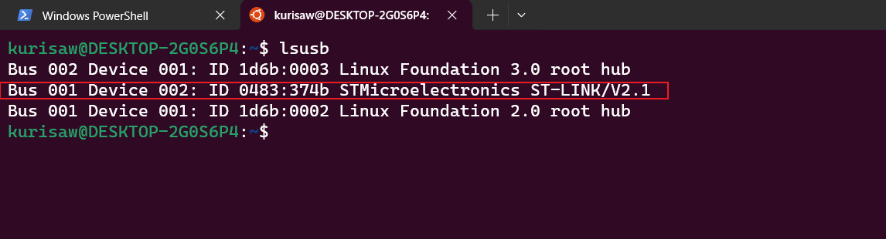

## 具体步骤：

首先在windows中安装 USBIP 工具，在GitHub上下载安装包并根据README文档的说明进行操作：

> 下载链接：https://github.com/dorssel/usbipd-win/releases

同时在 WSL Linux 端也需要安装编译内核所需的库和工具，为后续做准备：

```bash
$ sudo apt install build-essential flex bison libssl-dev libelf-dev libncurses-dev autoconf libudev-dev libtool
```

打开wsl ubuntu终端使用命令：`uname -r`得到版本号，同时根据版本号使用管理员模式新建目录


```bash
$ sudo mkdir /usr/src/5.15.90.1-microsoft-standard-WSL2
```

同时我们去GitHub下载一份wsl内核源码：https://github.com/microsoft/WSL2-Linux-Kernel/releases

这里的版本就是你使用命令 `uname -r` 得到的版本号，建议可以先手动安装压缩包，然后使用vscode连接wsl，把文件拖拽到wsl下

然后解压到指定路径下(这部分注意区分版本号，不要一昧照搬命令)：

```bash
$ sudo tar -xzvf WSL2-Linux-Kernel-linux-msft-wsl-5.15.90.1.tar.gz -C /usr/src/5.15.90.1-microsoft-standard-WSL2/

$ cd /usr/src/5.15.90.1-microsoft-standard-WSL2/
$ sudo mv WSL2-Linux-Kernel-linux-msft-wsl-5.15.90.1/* ./ && sudo rm -r WSL2-Linux-Kernel-linux-msft-wsl-5.15.90.1
```

然后将内核的一些配置信息复制到当前文件夹下：

```bash
$ sudo cp /proc/config.gz config.gz
$ sudo gunzip config.gz
$ sudo mv config .config
```

接着我们执行menuconfig命令打开图形化菜单

```bash
$ sudo make menuconfig
```

进入如下路径：`> Device Drivers > USB support`

下面是一些必须的添加项，一般默认都是选中的，不过最好还是检查下：

```bash
Device Drivers -> USB Support
Device Drivers -> USB Support -> USB announce new devices
Device Drivers -> USB Support -> USB Modem (CDC ACM) support
Device Drivers -> USB Support -> USB/IP
Device Drivers -> USB Support -> USB/IP -> VHCI HCD
Device Drivers -> USB Serial Converter Support
Device Drivers -> USB Serial Converter Support -> USB FTDI Single port Serial Driver
```

同时记得关闭 `Device Drivers -> USB Support -> USB/IP -> Debug messages for USB/IP`这一选项，否则调试信息会非常影响你的使用体验

另外也可以添加你具体所需的USB模块勾选上，保存退出后执行内核编译

```bash
$ sudo make -j8 
```

内核编译期间发生报错：


这主要是由于系统缺少dwarves软件包导致的，我们使用apt命令安装并继续执行编译：

```bash
$ sudo apt install dwarves

$ sudo make -j8 && sudo make modules_install -j8 && sudo make install -j8
```

发现又产生了报错：


查找资料似乎说明的是这仅仅是个警告，我通过禁用BTF的调试信息解决了这个问题

```bash
$ sudo vi .config

# 找到宏`CONFIG_DEBUG_INFO_BTF`并将value改为 `n`
```

安装内核时发生报错：


解决方式有两种：

* 1.可以选择在`.config`中禁用宏`CONFIG_X86_X32`
* 2.找到合适的binutils版本使其能够编译

我选择的是第一种，根据我在网上找到的说法是：

```bash
# 除非您想要它并且拥有它的用户空间，否则 X32 并不是特别有用。请注意，X32 是 64 位的 x32 ABI，它是编译为在 64 位长模式下运行的“32 位”短指针代码，与真正的本机 32 位二进制/ABI 支持不同。这是一种具有非常具体的利基的特殊模式。

# 您可以在内核配置中禁用[CONFIG_X86_X32](https://cateee.net/lkddb/web-lkddb/X86_X32.html)或获取具有 elf32_x86_64 目标支持的 binutils。如何获取 binutils 取决于您的发行版。
```

所以我选择禁用宏`CONFIG_X86_X32`，之后继续执行命令：

```bash
$ sudo make modules_install -j8
$ sudo make install -j8
```


之后就可以选择编译 USBIP 工具了：

```bash
$ cd tools/usb/usbip
$ sudo ./autogen.sh
$ sudo ./configure
$ sudo make install -j8
```

复制工具库位置，以便 usbip 工具可以获取到：

```bash
$ sudo cp libsrc/.libs/libusbip.so.0 /lib/libusbip.so.0
```

安装 usb.ids 以便显示 USB 设备的名称：

```bash
$ sudo apt-get install hwdata
```

重启WSL：

```bash
$ wsl --shutdown
```

下面进行测试是否成功：
打开powershell：

```bash
$ usbipd wsl list
```

假设我们需要在wsl使用的 usb 设备为 `ST-Link Debug, USB 大容量存储设备, USB 串行设备 (COM3)`，设备id为 `0483:374b`

我们使用命令附加设备到 wsl2 中

```bash
$ usbipd wsl attach --hardware-id "0483:374b"
```


此时我们打开一个 wsl 终端，使用命令 `lsusb` 即可看到附加到 wsl 的设备




然后我们再次回到 powershell ，执行 `usbipd wsl list`命令，可以看到此时的 usb 设备已经成功添加到 wsl 了


